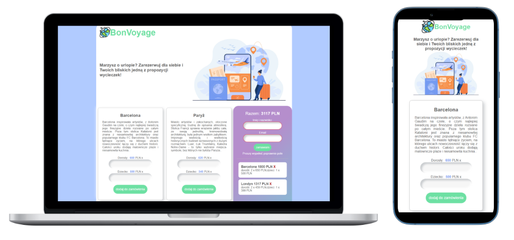
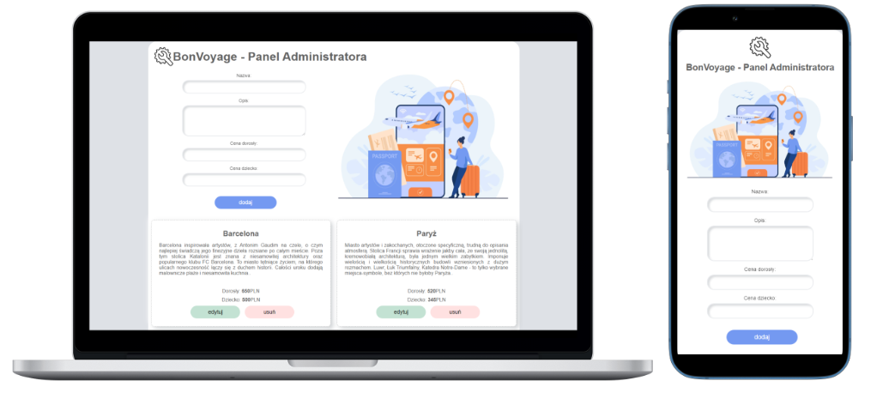

# Excursions platform :airplane:

In this project, the challange was to create platform, which consists of two parts - in the first panel, you are able to create an excursion offer as an **admin** and in the second panel, you can purchase order as a **client**. Excursions and orders are stored in database - **API** running on **JSON Server**.  Details are presented below.

&nbsp;

 ## :hammer_and_pick: Technologies

&nbsp;

## :raising_hand_woman: First panel -  Client
 
You are able to:

-   **add excursion** to the cart
-   **preview of the cart** (**updated** cost and list of added excursions)
-   **remove excursions** from the cart 
-   **place an order** 
  
&nbsp;

## :woman_technologist: Second panel - Admin 

You are able to:

-   **add** new excursion
-   **remove** excursion
-   **edite** saved excursions

&nbsp;

## :gear: Installation

The project uses [node](https://nodejs.org/en/), [npm](https://www.npmjs.com/) and [JSON server](https://www.npmjs.com/package/json-server). 

To run it locally you should install all dependencies:

    npm i

To run webpack and create a localhost port you should type:

    npm start
    
To run JSON-server you should type in second terminal:

    json-server --watch ./data/excursions.json
    
Both panels should be available at:

-  http://localhost:8080/
-  http://localhost:8080/admin.html

    
  &nbsp;  
    

## :envelope_with_arrow: Feel free to contact me
The project was made by Anna Królikowska

Find me on [**LINKEDIN**](https://www.linkedin.com/in/krolikowska-ann/) or [**GitHub**](https://github.com/annakrolikowska)
